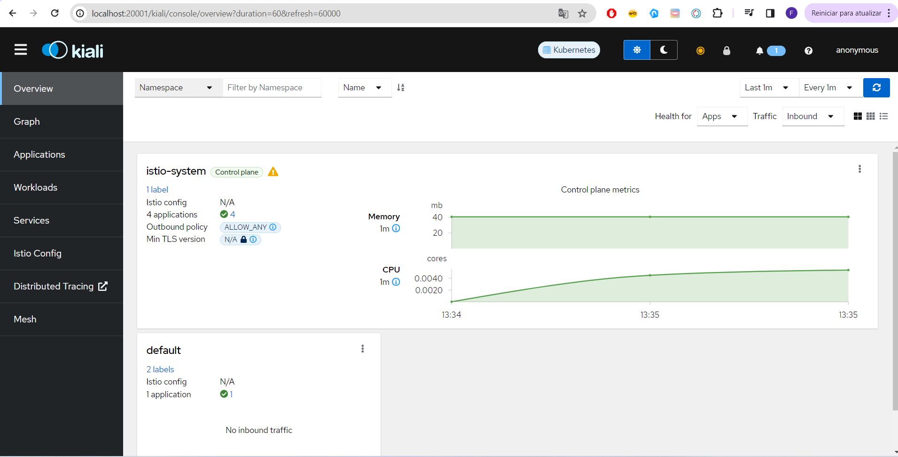
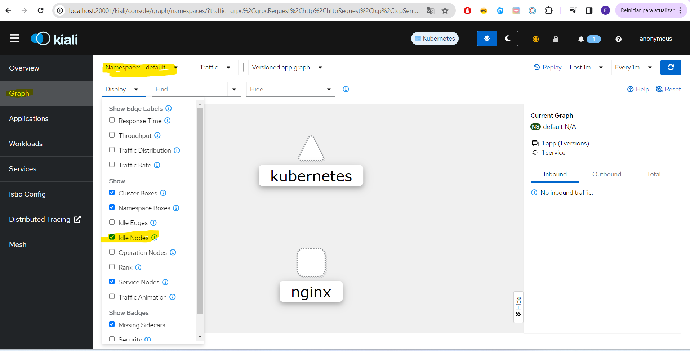
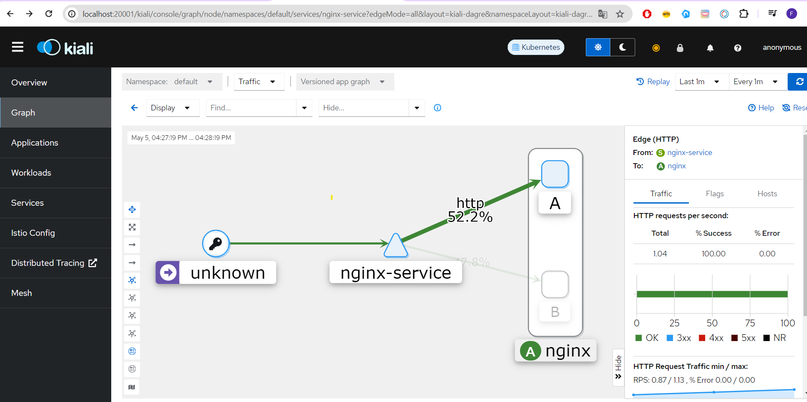
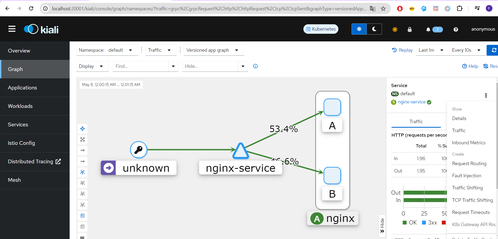
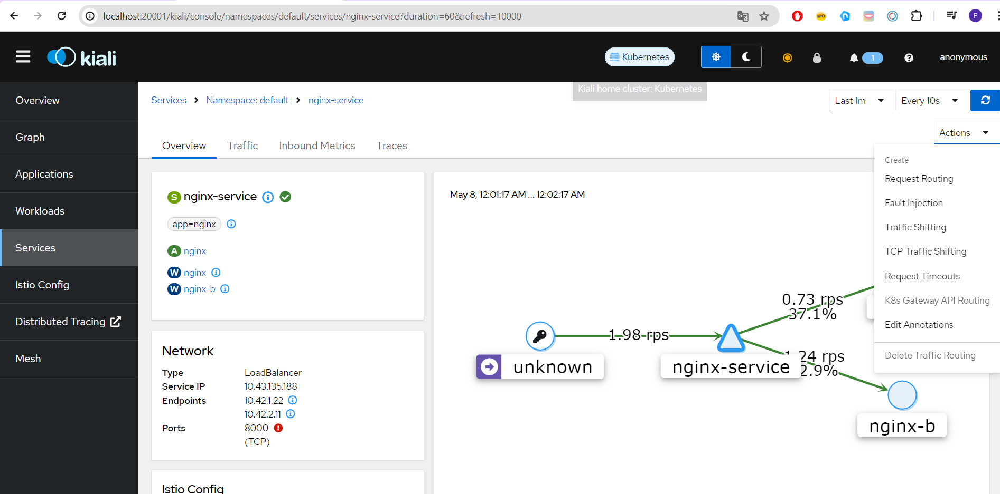
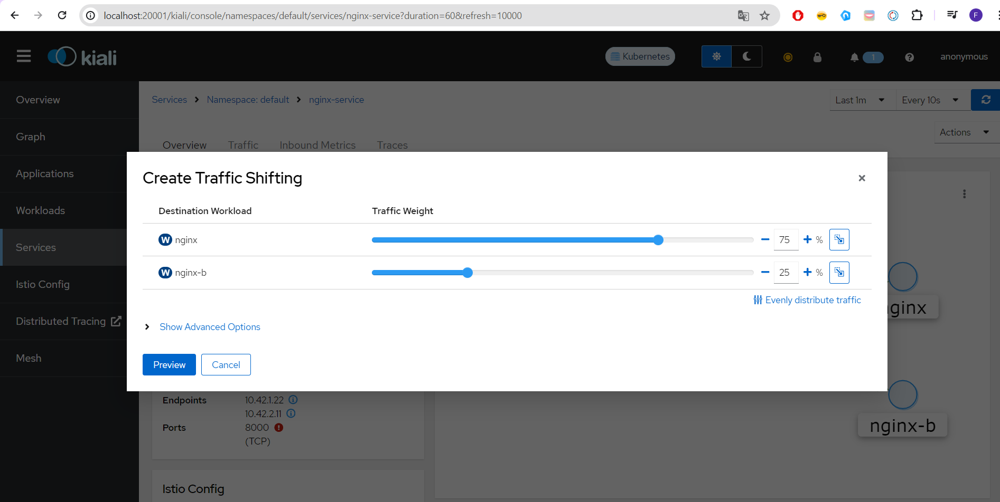
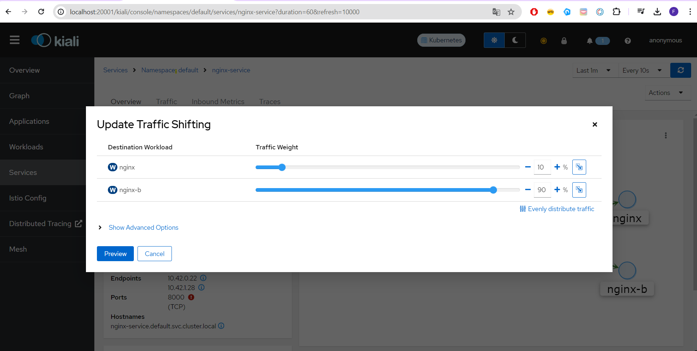
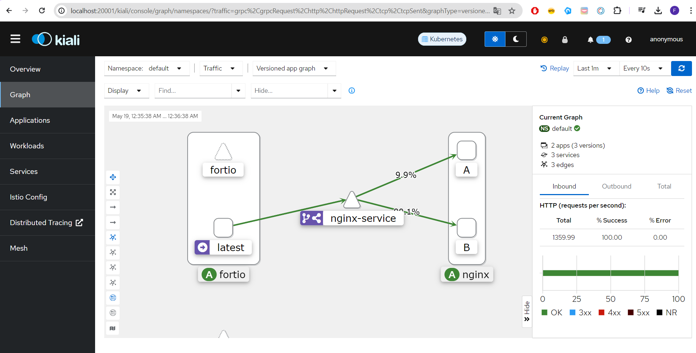

# Resumo sobre istio

O Istio é uma malha de serviço de código aberto que ajuda as organizações a executar apps distribuídos baseados em microsserviços em qualquer lugar. Por que usar o Istio? Com o Istio, as organizações podem proteger, conectar e monitorar microsserviços para modernizar os apps empresariais com mais rapidez e segurança.]


### Arquiterura resumida

As configurações do istio estão no istioD, que é um daemon com as definições de segurança, tráfego, resiliência, ou qualquer outra coisa definida. Chamamos o istioD de control plane. A cada pod que contenha definição do istio, haverá também um proxy do istio com as definições para aquele pod. Isso demonstra que a comunicação inicial entre pods na verdade sempre será a princípio entre proxies istio, e isso de cara demonstra como é fácil para o istio conter métricas de aplicação. Essa comunicação entre pods se chama Data plane.


Para praticar um pouco em nosso ambiente local, iremos instalar um cluster de kubernetes local, o [k3d](https://k3d.io/). Segue abaixo o comando para instalação no linux:

```
wget -q -O - https://raw.githubusercontent.com/k3d-io/k3d/main/install.sh | bash

```

Agora vamos criar o cluster no k3d, fazendo binding da nossa posta 8000 para a porta nodeport do kubernetes (30000)

```
k3d cluster create -p "8000:30000@loadbalancer" --agents 2
```

Após executado, vamos mudar o contexto do kubernetes para nosso novo cluster:

```
fabio@DESKTOP-345:~/fullcycle/kubernetes/k8s/namespaces$ kubectl config use-context k3d-k3s-default
Switched to context "k3d-k3s-default".
```


Agora podemos ver todos os nodes criados pelo nosso comando (2), bem como o node correspondente ao control plane.

```
fabio@DESKTOP-67:~/fullcycle/kubernetes/k8s/namespaces$ kubectl get nodes
NAME                       STATUS   ROLES                  AGE     VERSION
k3d-k3s-default-server-0   Ready    control-plane,master   4m2s    v1.28.8+k3s1
k3d-k3s-default-agent-1    Ready    <none>                 3m57s   v1.28.8+k3s1
k3d-k3s-default-agent-0    Ready    <none>                 3m57s   v1.28.8+k3s1
```

#### Instalando o istioctl

No [site do istio](https://istio.io/latest/docs/setup/getting-started/#download) temos o passo a passo de como instalar e configurar o istioctl no nosso terminal. Basicamente faremos os seguintes comandos:

```
curl -L https://istio.io/downloadIstio | sh -
```

Isso baixará o istio na nossa máquina. Moverei a pasta baixada para o /opt, e irei expor o bin dessa pasta na variável path:

```
sudo mv /home/fabiobione/fullcycle/istio-1.21.2/ /opt/
...
export PATH="$PATH:/opt/istio-1.21.2/bin"
```

Após isso, o comando istioctl deve ser reconhecido pelo terminal.


#### Instalando o istio no nosso cluster.

Iremos instalar o profile default do istio, que trata do istioD e do gateway de ingress.


```
fabio@DESKTOP-345:/opt/istio-1.21.2$ istioctl install
This will install the Istio 1.21.2 "default" profile (with components: Istio core, Istiod, and Ingress gateways) into the cluster. Proceed? (y/N) y
✔ Istio core installed
✔ Istiod installed
✔ Ingress gateways installed
✔ Installation complete
Made this installation the default for injection and validation.
```

Agora vamos verificar alguns componentes criados pelo istio:

```
fabio@DESKTOP-345:/opt/istio-1.21.2$ kubectl get ns
NAME              STATUS   AGE
kube-system       Active   32m
kube-public       Active   32m
kube-node-lease   Active   32m
default           Active   32m
istio-system      Active   3m16s
fabio@DESKTOP-345:/opt/istio-1.21.2$ kubectl get pods -n istio-system
NAME                                    READY   STATUS    RESTARTS   AGE
istiod-5668557955-t2t85                 1/1     Running   0          3m39s
istio-ingressgateway-84cd7548bb-bsjcj   1/1     Running   0          2m41s
fabio@DESKTOP-345:/opt/istio-1.21.2$ kubectl get services -n istio-system
NAME                   TYPE           CLUSTER-IP     EXTERNAL-IP   PORT(S)
          AGE
istiod                 ClusterIP      10.43.5.32     <none>        15010/TCP,15012/TCP,443/TCP,15014/TCP        4m12s
istio-ingressgateway   LoadBalancer   10.43.252.25   <pending>     15021:30993/TCP,80:31587/TCP,443:31874/TCP   3m14s
```

Podemos ver a criação do namespace istio-system. Nesse namespace foram criados pods para istiod e ingress. No service, temos o loadbalancer do gateway de ingress.


### Inserindo sidecar em um container

Sidecar é o proxy criado pelo istio que ficará na frente dos conteineres. E para habilitar o proxy, podemos executar o seguinte comando: 

```
kubectl label namespace default istio-injection=enabled
```

Esse comando libera a injeção feita pelo istio no namespace default. Agora podemos executar um deployment no namespace default, e o seu container já terá 2 pods, no nosso caso o do istio (sidecar proxy) e o do nginx, como determinado pelo deployment.yml abaixo:

```
apiVersion: apps/v1
kind: Deployment
metadata:
  name: nginx
spec:
  selector:
    matchLabels:
      app: nginx
  template:
    metadata:
      labels:
        app: nginx
    spec:
      containers:
      - name: nginx
        image: nginx
        resources:
          limits:
            memory: "128Mi"
            cpu: "500m"
        ports:
        - containerPort: 80

```

Ao aplicar o deployment, podemos reparar a criação de 2 pods no container do nginx:

```
kubectl apply -f deployment.yml
. . . 
fabio@DESKTOP-234:~/fullcycle/istio$ kubectl get pods
NAME                     READY   STATUS    RESTARTS   AGE
nginx-57f79d6686-kzsvk   2/2     Running   0          5m27s

```


### Addons importantes para incrementar

Na página do [istio getting started](https://istio.io/latest/docs/setup/getting-started/#dashboard) temos o [github de samples](https://github.com/istio/istio/tree/release-1.21/samples/addons). Vamos instalar as seguintes ferramentas:

* grafana - Plataforma visual de métricas de 
aplicações;
* jaeger - É um mecanismo para rastreamento de requisições de uma requisição/serviço;
* kiali - Interface gráfina para observabilidade de serviços de rede;

Vamos executar na ordem de funcionamento, usando o raw dos arquivos hospedados no github:


```
#prometheus
kubectl apply -f https://raw.githubusercontent.com/istio/istio/release-1.21/samples/addons/prometheus.yaml
. . . 
#kiali
kubectl apply -f https://raw.githubusercontent.com/istio/istio/release-1.21/samples/addons/kiali.yaml
. . . 
#jaeger
kubectl apply -f https://raw.githubusercontent.com/istio/istio/release-1.21/samples/addons/jaeger.yaml
. . .
#grafana
kubectl apply -f https://raw.githubusercontent.com/istio/istio/release-1.21/samples/addons/grafana.yaml
```

Olhando o conteúdo desses deployments podemos observar que estão sendo aplicados no namespace istio-system. Vamos dar uma olhada nmos pods criados nesse namespace:

```
fabio@DESKTOP-345:~/fullcycle/istio$ kubectl get pods -n istio-system
NAME                                    READY   STATUS              RESTARTS   AGE
istiod-5668557955-t2t85                 1/1     Running             0          3d22h
istio-ingressgateway-84cd7548bb-bsjcj   1/1     Running             0          3d22h
prometheus-7545dd48db-rftbh             0/2     ContainerCreating   0          6m23s
jaeger-7d7d59b9d-lw65w                  0/1     ContainerCreating   0          3m40s
grafana-6f68dfd8f4-jzm56                0/1     ContainerCreating   0          2m27s
kiali-588bc98cd-b2cnl                   1/1     Running             0          5m31s
```

#### Vendo o dashboard do kiali

Executamos o seguinte comando:

```
fabio@DESKTOP-45:~/fullcycle/istio$ istioctl dashboard kiali
http://localhost:20001/kiali
```

Se o browser não abrir automaticamente, podemos acessar a url http://localhost:20001/kiali no browser. Vamos ver como é a página inicial:



Vamos dar também uma olhada na aba Graphs, onde ao selecionar o namespace default e permitir display "idles nodes" conseguiremos ver o node de kubernetes e nginx.



### Reforçando conceitos do istio

* __Ingress gateway__ - Controlador de entrada de requisições em um serviço

* __Virtual service__ - Camada virtual complementar ao service do kubernetes que permite configurações de roteamento de um serviço

* __Destination rules__ - Set de regras para configurar o que acontece com o tráfego quando chega em determinado destino.

Agora, para pôr a mão na massa, vamos criar um arquivo deployment do nginx, 1 com nome nginx, e a imagem wesleywillians/nginx-ab, outro com nome nginx-b, e a imagem wesleywillians/nginx-ab:b. Ambos atendem pela label nginx. Criaremos também um service para acessar os apps da label nginx, e vamos ver o comportamento das requisições:

deployment.yml:
```
apiVersion: apps/v1
kind: Deployment
metadata:
  name: nginx
spec:
  selector:
    matchLabels:
      app: nginx
  template:
    metadata:
      labels:
        app: nginx
    spec:
      containers:
      - name: nginx
        image: wesleywillians/nginx-ab
        resources:
          limits:
            memory: "128Mi"
            cpu: "500m"
        ports:
        - containerPort: 80

---

apiVersion: apps/v1
kind: Deployment
metadata:
  name: nginx-b
spec:
  selector:
    matchLabels:
      app: nginx
  template:
    metadata:
      labels:
        app: nginx
    spec:
      containers:
      - name: nginx
        image: wesleywillians/nginx-ab:b
        resources:
          limits:
            memory: "128Mi"
            cpu: "500m"
        ports:
        - containerPort: 80

---

apiVersion: v1
kind: Service
metadata:
  name: nginx-service
spec:
  type: LoadBalancer
  selector:
    app: nginx
  ports:
  - port: 8000
    targetPort: 80
    nodePort: 30000

```

Aplicaremos o arquivo:

```
fabio@DESKTOP-343:~/fullcycle/istio$ kubectl apply -f .
deployment.apps/nginx unchanged
deployment.apps/nginx-b created
service/nginx-service created
```

Agora vamos fazer algumas requisições na url da aplicação e ver como serão as chamadas:

```
fabio@DESKTOP-455:~/fullcycle/istio$ while true;do curl http://localhost:8000; echo; sleep 0.
5; done;
Full Cycle B
Full Cycle B
Full Cycle B
Full Cycle A
Full Cycle A
Full Cycle B
Full Cycle B
Full Cycle B
Full Cycle A
Full Cycle B
Full Cycle A
Full Cycle B
```


Vamos modificar o arquivo deployment. Adicionando no primeiro a version A, e no segundo a version B para diferenciar.

```
spec:
  selector:
    matchLabels:
      app: nginx
  template:
    metadata:
      labels:
        app: nginx
        version: A
. . . 

spec:
  selector:
    matchLabels:
      app: nginx
  template:
    metadata:
      labels:
        app: nginx
        version: B
```


Agora comando de apply:
```
fabio@DESKTOP-343:~/fullcycle/istio$ kubectl apply -f .
```

E vamos executar o script while, e o comando de dashboard para ver a diferenciação de tráfego.

```
while true;do curl http://localhost:8000; echo; sleep 0.5; done;
. . .

fabio@DESKTOP-544:~$ istioctl dashboard kiali
http://localhost:20001/kiali
```

Agora acessando o Graph do dashboard, veremos o seguinte:




### Deploy canário

Deploy canário é uma estratégia de atualização de versão suavizada, a fim de consolidar a mudança aos poucos. 

Pensando em executar isso usando kubernetes, imagine uma aplicação que já esteja na versão 1.0 em produção. Essa aplicação poderia ter 10 réplicas. Ao subir a nova versão 1.1, podemos manter a versão 1.0 com 8 réplicas, e a 1.1. terá 2 réplicas. De forma automática, o load balancer irá jogar em média 80% das requisições para os pods de 1.0, e 20% da 1.1. Você terá um grupo menorde requisições provando da nova implementação e em exposição a possíveis falhas. Mas a maioria dos usuário não terão impacto. Conforme for validando a nova implementação 1.1., podemos subtrair pods da 1.0, adicionando na 1.1. Até a 1.1 obter todos os 10 pods.

Para fazer isso, poderíamos alterar no deployment o campo réplicas.

Se formos aplicar a lógica de distribuição de requisições com istio, tendo cada deploy 1 réplica, temos a seguinte forma:

Em Graph, no lado direito, selecionamos o menu de contexto e Details do service.


Em Actions, selecionamos Traffic shifting


Agora selecionamos o peso da disteribuição de tráfego.



#### Executando carga de requisições com o Fortio

Na documentação do istio, temos a descrição de instalação do Fortio para testarmos o tráfego, na seção [circuit-breaking](https://istio.io/latest/docs/tasks/traffic-management/circuit-breaking/). Nela temos os comando de criação do container do Fortio:

```
kubectl apply -f https://raw.githubusercontent.com/istio/istio/release-1.21/samples/httpbin/sample-client/fortio-deploy.yaml
. . . 
export FORTIO_POD=$(kubectl get pods -l app=fortio -o 'jsonpath={.items[0].metadata.name}')
```

Agora vamos rodar requisições do fortio por 200 segundos:

```
kubectl exec "$FORTIO_POD" -c fortio -- fortio load -c 2 -qps 0 -t 200s -loglevel Warning http://nginx-service:8000
```

Vamos rodar também o kiali para ver os detalhes:

```
fabio@DESKTOP-2134:~$ istioctl dashboard kiali
http://localhost:20001/kiali
Failed to open browser; open http://localhost:20001/kiali in your browser.
```

Agora vamos mudar as configurações de tráfego novamente no traffic shifting:



O resultado é que as requisições vão se distribuir naturalmente conforme configuramos:




### Configurando um virtual service e destination rule para controle de carga via yml

No passo anterior executamos configuração manual no kiali para definir a carga. Por baixo dos panos são criados arquivos yml. Vamos criar esses arquivos para serem gerados via kubectl.

Primeiro iremos configurar um arquivo de __DestinationRule__.

```
#ds.yml

apiVersion: networking.istio.io/v1alpha3
kind: DestinationRule
metadata:
  name: nginx-dr
spec:
  host: nginx-service
  subsets:
    - name: v1
      labels:
        version: A
    - name: v2
      labels:
        version: B
```

Configuramos a ruleset v1 para a versão A, e a v2 para a version B. Agora definiremos o VirtualService, que irá utilizar essas destinações com carga definida:

```
#vs.yml

apiVersion: networking.istio.io/v1alpha3
kind: VirtualService
metadata:
  name: nginx-vs
spec:
  hosts:
  - nginx-service
  http:
    - route:
      - destination:
          host: nginx-service
          subset: v1
        weight: 90
      - destination:
          host: nginx-service
          subset: v2
        weight: 10
```

Nesse caso, configuramos para o subset v1, peso 90, e peso 10 para o subset v2. Agora daremos apply em todos os arquivos criados:

```
fabio@DESKTOP-23424:~/fullcycle/istio$ kubectl apply -f .
deployment.apps/nginx unchanged
deployment.apps/nginx-b unchanged
service/nginx-service unchanged
destinationrule.networking.istio.io/nginx-dr created
virtualservice.networking.istio.io/nginx-vs created
```

Iremo agora rodar o kiali dashboar, bem como executaremos o teste de carga com o fortio, isso em terminais diferentes, visto que esses comandos travam o terminal:

```
kubectl exec "$FORTIO_POD" -c fortio -- fortio load -c 2 -qps 0 -t 200s -loglevel Warning http://nginx-service:8000

istioctl dashboard kiali
```

Se tudo der certo, a distribuição no Graph do kiali mostrará a divisão de tráfego aproximada de 90/10.


### Configurando algoritmos de load balancer

Por padrão, o algoritmo utilizado para fazer o balanceamento é round robin, mas temos outros, como least connection, random. Vamos configurar o destination rule com essa definição:

```
apiVersion: networking.istio.io/v1alpha3
kind: DestinationRule
metadata:
  name: nginx-dr
spec:
  host: nginx-service
  trafficPolicy:
    loadBalancer:
      simple: ROUND_ROBIN
  subsets:
    - name: v1
      labels:
        version: A
      trafficPolicy:
        loadBalancer:
          simple: LEAST_CONN
    - name: v2
      labels:
        version: B
```

Ao aplicar o arquivo, levando em consideração que haja mais réplicas por deployment, o algoritmo selecionado irá atuar no balanceamento de carga.

### Entendendo stick session e consistent hash

No nosso cenário atual, temos 2 versões do nginx convivendo, sendo balanceado via peso. Isso pode provocar algumas situações, como em uma requisição o usuário acessar uma versão da aplicação, e, numa nova requisição do mesmo usuário, outra versão. Imagine que na primeira versão ele tem um formulário de um jeito, e na outra o formulário muda. Isso trás uma experiência inconsistente. O stick session seria uma "sessão fixada" para o usuário. Através de uma forma de identificação do usuário, via consistent hash, uma aplicação, identificamos o usuário, e esse sempre acessará a mesma versão da primeira execução. O consistent hash pode ser criado via header, parâmetro, ip, entre outros. No nosso teste, usaremos um header para diferenciar. Para Isso, criaremos o arquivo consistent-hash, com virtualservice e destination rule parecido com o do exemplo anterior, mas com algumas modificações importantes:

```
apiVersion: networking.istio.io/v1alpha3
kind: VirtualService
metadata:
  name: nginx-vs
spec:
  hosts:
  - nginx-service
  http:
    - route:
      - destination:
          host: nginx-service
          subset: all


---

apiVersion: networking.istio.io/v1alpha3
kind: DestinationRule
metadata:
  name: nginx-dr
spec:
  host: nginx-service
  trafficPolicy:
    loadBalancer:
      consistentHash:
        httpHeaderName: "x-user"
  subsets:
    - name: all
      labels:
        app: nginx
```

No VirtualService, temos agora apenas 1 subset que atenderá a todas as versões. A nossa trafficPolicy em DestinationRule terá um atributo consistentHash que definirá que o header *x-user* identificará um usuário. Vamos aplicar o arquivo. Entraremos em um dos pods e executaremos *curl* algumas vezes para a nossa url, mas agora utilizando esse header, e vamos ver o que irá acontecer:

```
fabio@DESKTOP-234:~/fullcycle/istio$ kubectl apply -f deployment.yml
deployment.apps/nginx configured
deployment.apps/nginx-b configured
service/nginx-service unchanged

fabio@DESKTOP-234:~/fullcycle/istio$ kubectl get pods
NAME                             READY   STATUS    RESTARTS       AGE
fortio-deploy-689bd5969b-h7fvb   2/2     Running   2 (7h4m ago)   6d20h
nginx-b-54bd548c87-lvnt4         2/2     Running   2 (7h4m ago)   6d20h
nginx-5679dcd68b-ls86h           2/2     Running   2 (7h4m ago)   6d20h

fabio@DESKTOP-234:~/fullcycle/istio$ kubectl exec -it nginx-5679dcd68b-ls86h -- bash
Full Cycle Aroot@nginx-5679dcd68b-ls86h:/# curl --header "x-user: fabio" http://nginx-service:8000
Full Cycle Aroot@nginx-5679dcd68b-ls86h:/# curl --header "x-user: fabio" http://nginx-service:8000
Full Cycle Aroot@nginx-5679dcd68b-ls86h:/# curl --header "x-user: fabio" http://nginx-service:8000
Full Cycle Aroot@nginx-5679dcd68b-ls86h:/# curl --header "x-user: fabio" http://nginx-service:8000
Full Cycle Aroot@nginx-5679dcd68b-ls86h:/# curl --header "x-user: fabio" http://nginx-service:8000
Full Cycle Aroot@nginx-5679dcd68b-ls86h:/# curl --header "x-user: fabio" http://nginx-service:8000
Full Cycle Aroot@nginx-5679dcd68b-ls86h:/# curl --header "x-user: fabio" http://nginx-service:8000
Full Cycle Aroot@nginx-5679dcd68b-ls86h:/# curl --header "x-user: fabio" http://nginx-service:8000
Full Cycle Aroot@nginx-5679dcd68b-ls86h:/# curl --header "x-user: lopes" http://nginx-service:8000
Full Cycle Broot@nginx-5679dcd68b-ls86h:/# curl --header "x-user: lopes" http://nginx-service:8000
Full Cycle Broot@nginx-5679dcd68b-ls86h:/# curl --header "x-user: lopes" http://nginx-service:8000
Full Cycle Broot@nginx-5679dcd68b-ls86h:/# curl --header "x-user: lopes" http://nginx-service:8000
```

Podemos ver que na primeira chamada da url passando no header o x-user fabio, batemos no nginx A, após isso, toda chamada com esse valor no header bateu em A. Após isso, fizemos a chamada passando o x-user lopes, e bateu em B, e sempre que passamos esse valor batemos em B.